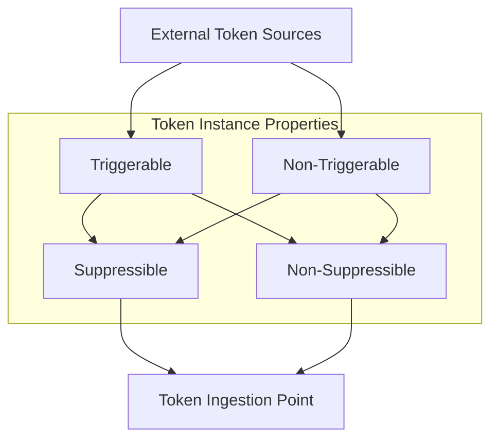
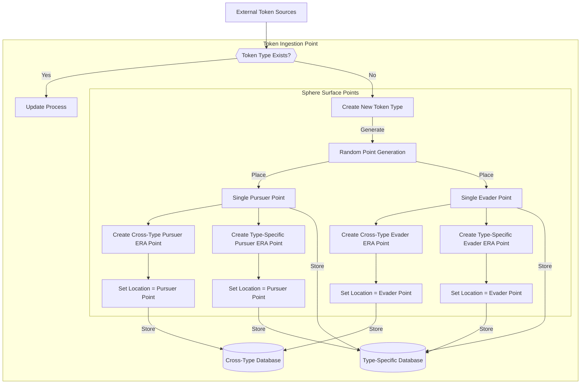
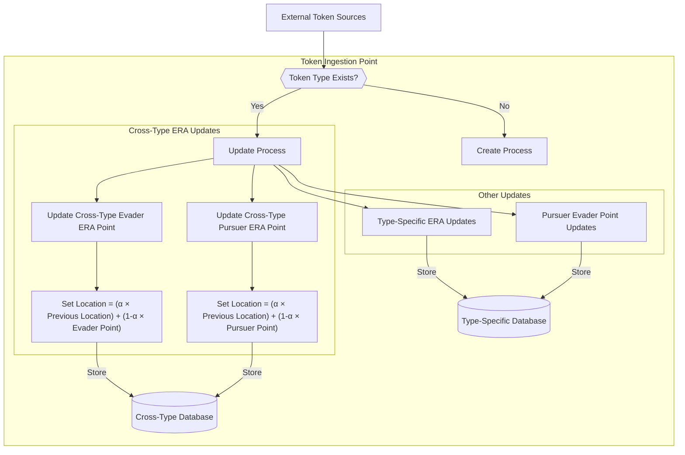
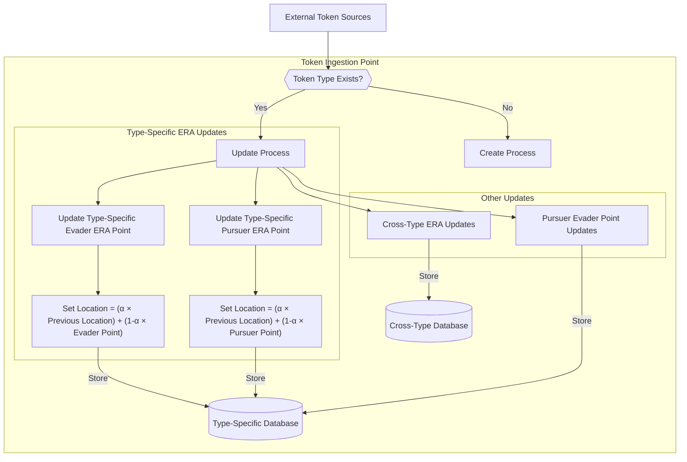
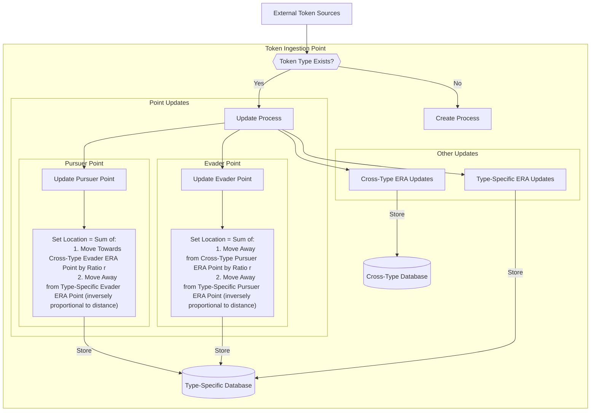

# Token Instance Flow

```mermaid
graph TD;
    ExternalSources["External Token Sources"]

    subgraph "Token Instance Properties"
        Triggerable["Triggerable"]
        NonTriggerable["Non-Triggerable"]
        Suppressible["Suppressible"]
        NonSuppressible["Non-Suppressible"]
    end

    ExternalSources --> Triggerable & NonTriggerable
    Triggerable & NonTriggerable --> Suppressible & NonSuppressible

    Ingestion["Token Ingestion Point"]
    
    Suppressible --> Ingestion
    NonSuppressible --> Ingestion
```

# Token Instance Ingestion and Type Creation

```mermaid
graph TD;
    ExternalSources["External Token Sources"]
    
    subgraph "Token Ingestion Point"
        TokenCheck{{"Token Type Exists?"}}
        UpdateProcess["Update Process"]
        CreateToken["Create New Token Type"]
        
        TokenCheck -->|Yes| UpdateProcess
        TokenCheck -->|No| CreateToken

        subgraph "Sphere Surface Points"
            SphereCreate["Random Point Generation"]
            NewPursuerPoint["Single Pursuer Point"]
            NewEvaderPoint["Single Evader Point"]
            
            CreateToken -->|Generate| SphereCreate
            SphereCreate -->|Place| NewPursuerPoint
            SphereCreate -->|Place| NewEvaderPoint

            CreateCrossEvaderERA["Create Cross-Type Evader ERA Point"]
            SetCrossEvaderLocation["Set Location = Evader Point"]
            CreateCrossPursuerERA["Create Cross-Type Pursuer ERA Point"]
            SetCrossPursuerLocation["Set Location = Pursuer Point"]
            CreateTypeEvaderERA["Create Type-Specific Evader ERA Point"]
            SetTypeEvaderLocation["Set Location = Evader Point"]
            CreateTypePursuerERA["Create Type-Specific Pursuer ERA Point"]
            SetTypePursuerLocation["Set Location = Pursuer Point"]

            NewEvaderPoint --> CreateCrossEvaderERA
            CreateCrossEvaderERA --> SetCrossEvaderLocation
            NewPursuerPoint --> CreateCrossPursuerERA
            CreateCrossPursuerERA --> SetCrossPursuerLocation
            NewEvaderPoint --> CreateTypeEvaderERA
            CreateTypeEvaderERA --> SetTypeEvaderLocation
            NewPursuerPoint --> CreateTypePursuerERA
            CreateTypePursuerERA --> SetTypePursuerLocation
        end

        CrossTypeDB[(Cross-Type Database)]
        TypeSpecificDB[(Type-Specific Database)]
        
        NewPursuerPoint -->|Store| TypeSpecificDB
        NewEvaderPoint -->|Store| TypeSpecificDB
        SetCrossEvaderLocation -->|Store| CrossTypeDB
        SetCrossPursuerLocation -->|Store| CrossTypeDB
        SetTypeEvaderLocation -->|Store| TypeSpecificDB
        SetTypePursuerLocation -->|Store| TypeSpecificDB
    end

    ExternalSources --> TokenCheck
```

# Cross-Type ERA Updates

```mermaid
graph TD;
    ExternalSources["External Token Sources"]
    
    subgraph "Token Ingestion Point"
        TokenCheck{{"Token Type Exists?"}}
        UpdateProcess["Update Process"]
        
        CreateProcess["Create Process"]
        TokenCheck -->|Yes| UpdateProcess
        TokenCheck -->|No| CreateProcess

        subgraph "Cross-Type ERA Updates"
            UpdateCrossEvaderERA["Update Cross-Type Evader ERA Point"]
            SetCrossEvaderLocation["Set Location = (α × Previous Location) + (1-α × Evader Point)"]
            UpdateCrossPursuerERA["Update Cross-Type Pursuer ERA Point"]
            SetCrossPursuerLocation["Set Location = (α × Previous Location) + (1-α × Pursuer Point)"]

            UpdateProcess --> UpdateCrossEvaderERA & UpdateCrossPursuerERA
            
            UpdateCrossEvaderERA --> SetCrossEvaderLocation
            UpdateCrossPursuerERA --> SetCrossPursuerLocation
        end

        subgraph "Other Updates"
            TypeSpecificERA["Type-Specific ERA Updates"]
            PursuerEvader["Pursuer Evader Point Updates"]
            
            UpdateProcess --> TypeSpecificERA
            UpdateProcess --> PursuerEvader
        end

        CrossTypeDB[(Cross-Type Database)]
        TypeSpecificDB[(Type-Specific Database)]
        
        SetCrossEvaderLocation -->|Store| CrossTypeDB
        SetCrossPursuerLocation -->|Store| CrossTypeDB
        TypeSpecificERA -->|Store| TypeSpecificDB
        PursuerEvader -->|Store| TypeSpecificDB
    end

    ExternalSources --> TokenCheck
```

# Type-Specific ERA Updates

```mermaid
graph TD;
    ExternalSources["External Token Sources"]
    
    subgraph "Token Ingestion Point"
        TokenCheck{{"Token Type Exists?"}}
        UpdateProcess["Update Process"]
        
        CreateProcess["Create Process"]
        TokenCheck -->|Yes| UpdateProcess
        TokenCheck -->|No| CreateProcess

        subgraph "Type-Specific ERA Updates"
            UpdateTypeEvaderERA["Update Type-Specific Evader ERA Point"]
            SetTypeEvaderLocation["Set Location = (α × Previous Location) + (1-α × Evader Point)"]
            UpdateTypePursuerERA["Update Type-Specific Pursuer ERA Point"]
            SetTypePursuerLocation["Set Location = (α × Previous Location) + (1-α × Pursuer Point)"]

            UpdateProcess --> UpdateTypeEvaderERA & UpdateTypePursuerERA
            
            UpdateTypeEvaderERA --> SetTypeEvaderLocation
            UpdateTypePursuerERA --> SetTypePursuerLocation
        end

        subgraph "Other Updates"
            CrossTypeERA["Cross-Type ERA Updates"]
            PursuerEvader["Pursuer Evader Point Updates"]
            UpdateProcess --> CrossTypeERA
            UpdateProcess --> PursuerEvader
        end

        CrossTypeDB[(Cross-Type Database)]
        TypeSpecificDB[(Type-Specific Database)]
        
        CrossTypeERA -->|Store| CrossTypeDB
        SetTypeEvaderLocation -->|Store| TypeSpecificDB
        SetTypePursuerLocation -->|Store| TypeSpecificDB
        PursuerEvader -->|Store| TypeSpecificDB
    end

    ExternalSources --> TokenCheck
```

# Pursuer and Evader Point Updates

```mermaid
graph TD;
    ExternalSources["External Token Sources"]
    
    subgraph "Token Ingestion Point"
        TokenCheck{{"Token Type Exists?"}}
        UpdateProcess["Update Process"]
        CreateProcess["Create Process"]
        
        TokenCheck -->|Yes| UpdateProcess
        TokenCheck -->|No| CreateProcess

        subgraph "Point Updates"
            subgraph "Pursuer Point"
                UpdatePursuerPoint["Update Pursuer Point"]
                SetPursuerLocation["Set Location = Sum of:
                1. Move Towards Cross-Type Evader ERA Point by Ratio r
                2. Move Away from Type-Specific Evader ERA Point (inversely proportional to distance)"]
                UpdatePursuerPoint --> SetPursuerLocation
            end

            subgraph "Evader Point"
                UpdateEvaderPoint["Update Evader Point"]
                SetEvaderLocation["Set Location = Sum of:
                1. Move Away from Cross-Type Pursuer ERA Point by Ratio r
                2. Move Away from Type-Specific Pursuer ERA Point (inversely proportional to distance)"]
                UpdateEvaderPoint --> SetEvaderLocation
            end

            UpdateProcess --> UpdatePursuerPoint & UpdateEvaderPoint
        end

        subgraph "Other Updates"
            CrossTypeERA["Cross-Type ERA Updates"]
            TypeSpecificERA["Type-Specific ERA Updates"]
            
            UpdateProcess --> CrossTypeERA & TypeSpecificERA
        end

        TypeSpecificDB[(Type-Specific Database)]
        CrossTypeDB[(Cross-Type Database)]
        
        SetPursuerLocation -->|Store| TypeSpecificDB
        SetEvaderLocation -->|Store| TypeSpecificDB
        CrossTypeERA -->|Store| CrossTypeDB
        TypeSpecificERA -->|Store| TypeSpecificDB
    end

    ExternalSources --> TokenCheck
```

