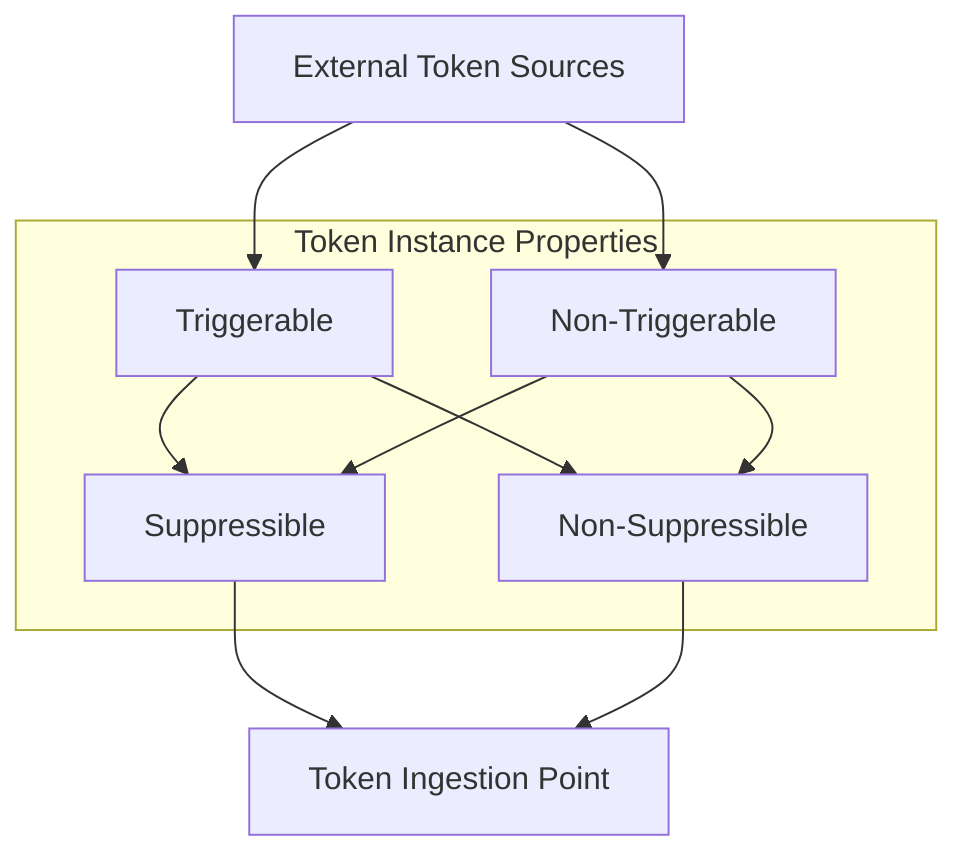
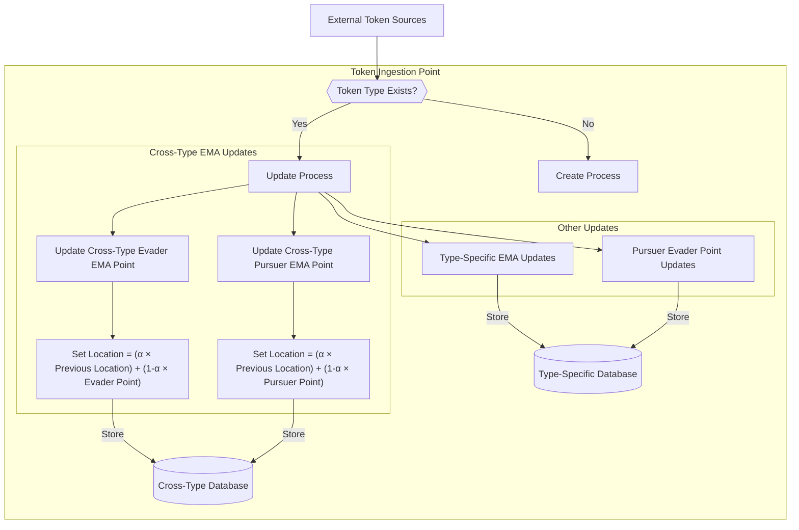
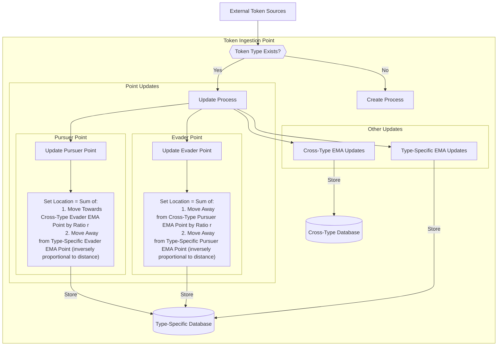
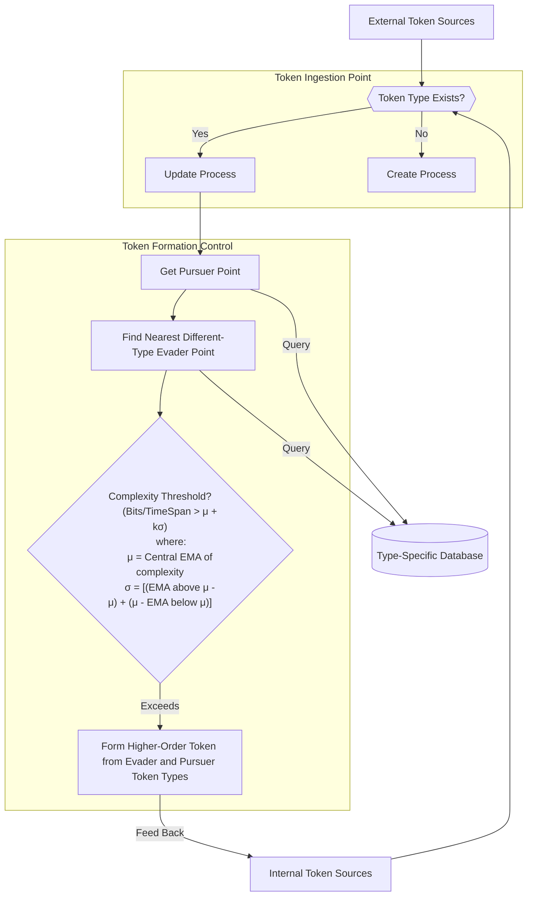
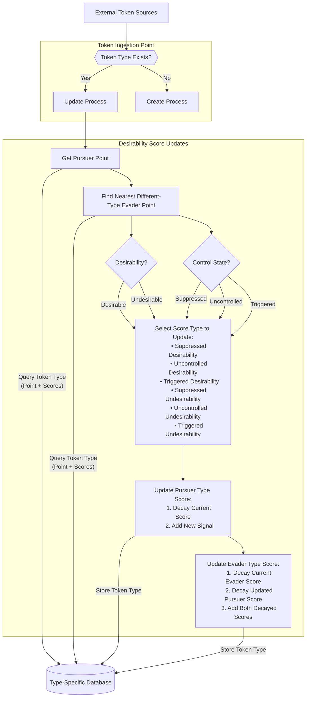
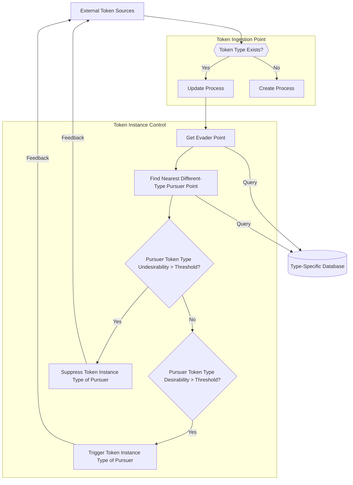

# Token Instance Flow

# Token Instance Ingestion and Type Creation

# Cross-Type EMA Updates

# Type-Specific EMA Updates

# Pursuer and Evader Point Updates

# Internal Token Formation Process

# Desirability and Undesirability Update Process

# External Token Triggering and Suppression Process

